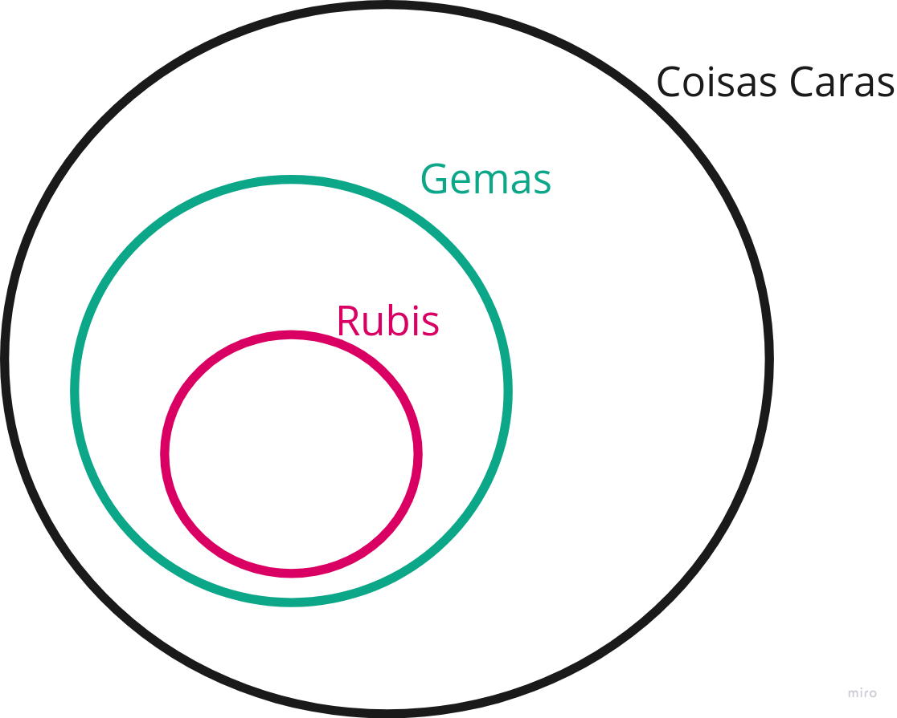
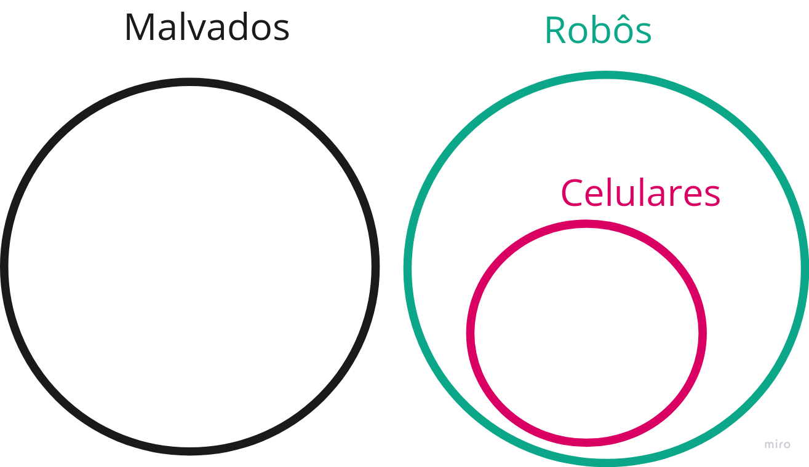
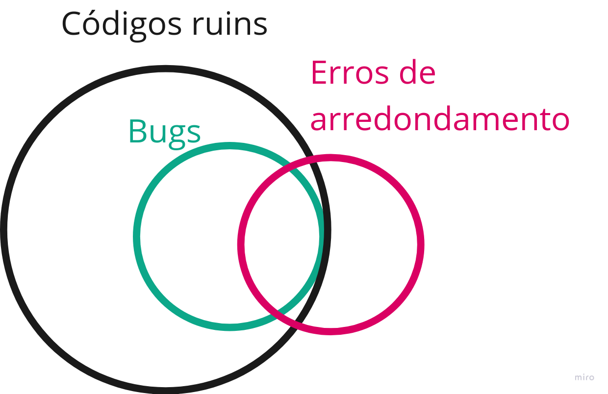
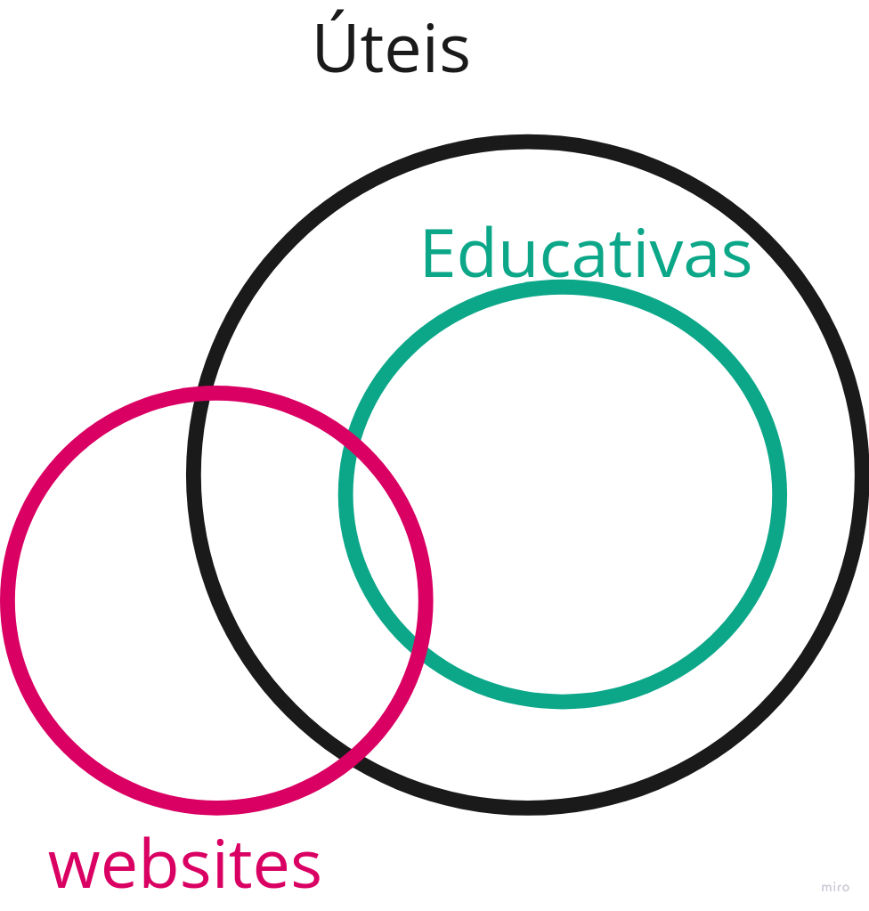

__1)Todas as gemas do jogo são caras.
Todos os rubis são gemas.__
Portanto, podemos concluir:
- a) Alguns rubis são caros.
> b) Todos os rubis são caros.
- c) Algumas gemas são caras.
- d) Nenhuma das anteriores.

__2)Nenhum robô é malvado.
Todos os celulares são robôs.__
Portanto, podemos concluir:
- a) Todos os celulares são malvados.
- b) Todos os robôs são celulares.
- c) Alguns celulares são malvados.
> d) Nenhuma das anteriores.

__3)Todos os bugs são códigos ruins.
Alguns erros de arredondamento são bugs.__
Portanto, podemos concluir:
- a) Todos os erros de arredondamento são códigos ruins.
> b) Alguns erros de arredondamento são códigos ruins.
- c) Alguns erros de arredondamento são falsos.
- d) Nenhuma das anteriores.

__4)Todas as coisas educativas são úteis.
Alguns websites não são úteis.__
Portanto, podemos concluir:
> a) Alguns websites não são educativos.
- b) Todos os websites são educativos.
- c) Todas as coisas educativas não são websites.
- d) Nenhuma das anteriores.

* * *